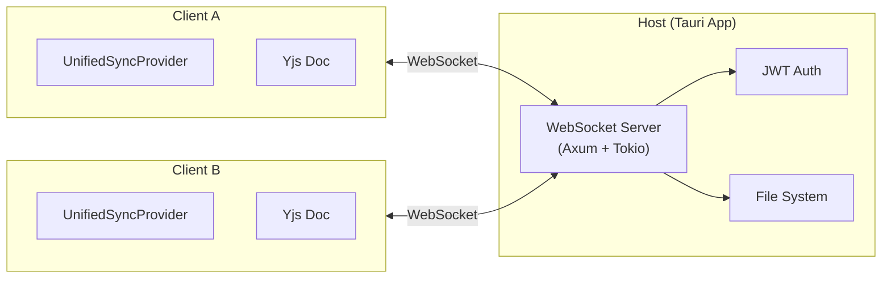
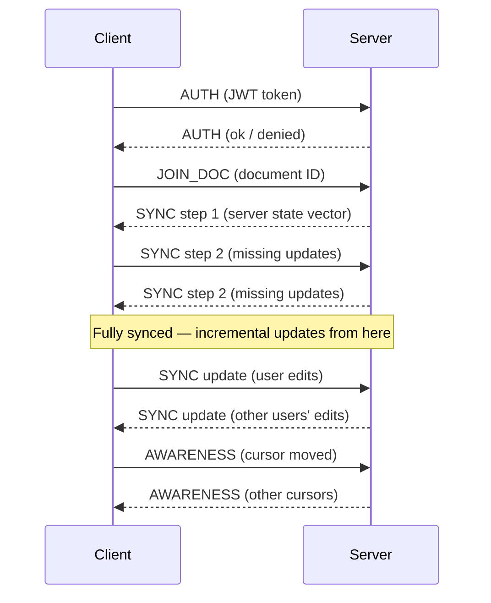

# Collaboration Protocol

Diagrammer's real-time collaboration uses **Protected Local mode** — one user hosts a WebSocket server via the Tauri backend, and other users on the same network connect as clients. All document sync uses **Yjs CRDTs** for conflict-free merging.

## Architecture Overview



### UnifiedSyncProvider

The `UnifiedSyncProvider` (`/src/collaboration/`) multiplexes three concerns over a single WebSocket connection:

1. **CRDT sync** — Yjs document updates
2. **Document CRUD** — list, get, save, delete documents
3. **Authentication** — JWT token exchange

## Wire Protocol

Messages are binary (ArrayBuffer). The first byte is the message type tag.

::: warning
The TypeScript protocol (`/src/collaboration/protocol.ts`) and the Rust protocol (`src-tauri/src/server/protocol.rs`) must stay in sync. A mismatch will cause silent data corruption or connection drops.
:::

### Message Types

| Tag | Name | Direction | Purpose |
|-----|------|-----------|---------|
| `0` | SYNC | Bidirectional | Yjs sync messages (step 1, step 2, update) |
| `1` | AWARENESS | Bidirectional | Cursor positions, selections, user presence |
| `2` | AUTH | Client → Server | Authentication token |
| `3` | DOC_LIST | Client → Server | Request document list |
| `4` | DOC_GET | Client → Server | Request document content |
| `5` | DOC_SAVE | Client → Server | Save document |
| `6` | DOC_DELETE | Client → Server | Delete document |
| `7` | DOC_EVENT | Server → Client | Document change notification |
| `10` | JOIN_DOC | Client → Server | Join a collaborative editing session |
| `11` | AUTH_LOGIN | Client → Server | Login with credentials |

### Sync Flow



## Yjs Integration

[Yjs](https://yjs.dev) provides the CRDT data structures that enable conflict-free merging. Diagrammer maps its document model onto Yjs types:

- **Y.Map** for shape properties
- **Y.Array** for shape ordering and collections
- Document updates are compact binary diffs, not full snapshots

When a user edits a shape, the change is applied to the local Yjs document, then the binary update is sent to the server, which broadcasts it to all connected clients. Each client applies the update to their local Yjs document and the Zustand stores are updated accordingly.

## Authentication

The host sets up JWT-based authentication:

1. Host configures a password for the session
2. Clients send `AUTH_LOGIN` with the password
3. Server responds with a signed JWT token
4. All subsequent messages include the JWT for authorization
5. Tokens have configurable expiry

The Rust backend handles JWT signing and verification using the `jsonwebtoken` crate, with password hashing via `bcrypt`.

## Offline Support

Diagrammer is offline-first. Collaboration features degrade gracefully when the network is unavailable.

### OfflineQueue

When the WebSocket is disconnected, save and delete operations are queued rather than dropped:

```
User saves document → OfflineQueue stores operation →
  Network reconnects → Queue processes in order → Server receives updates
```

### SyncStateManager

Coordinates the interaction between:
- The offline queue
- The storage layer
- The connection state

Handles automatic retry with exponential backoff.

### SyncQueueStorage

Persists the offline queue to **IndexedDB** so queued operations survive app restarts. On launch, any pending operations are processed once a connection is established.

## Server Implementation (Rust)

The WebSocket server lives in `src-tauri/src/server/`:

| File | Purpose |
|------|---------|
| `mod.rs` | Server startup, Axum router setup |
| `protocol.rs` | Message type definitions (must match TypeScript) |
| `websocket.rs` | Connection handling, message routing |
| `auth.rs` | JWT creation, verification, password validation |

The server uses **Axum** for HTTP/WebSocket handling and **Tokio** for async I/O. It binds to a configurable port on the local network and detects the host's LAN IP for easy sharing.
