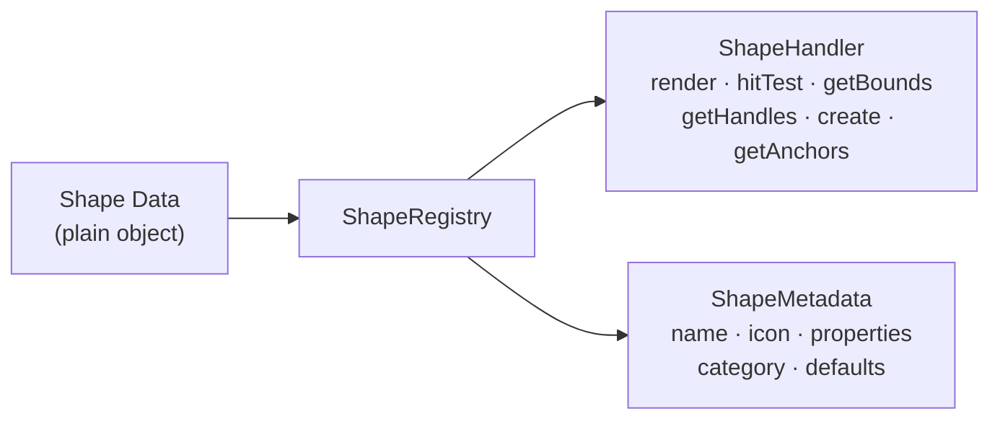
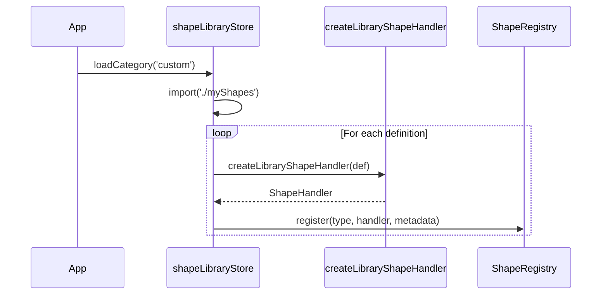
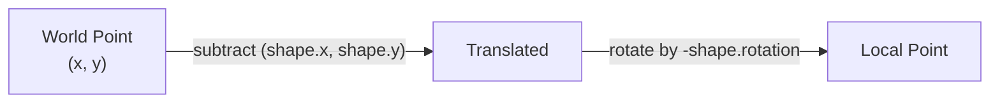

# Creating Custom Shapes

This guide walks through creating custom shapes for Diagrammer, from simple library shapes to fully custom handlers.

## Shape System Overview

Shapes in Diagrammer are **plain data objects** — they carry no methods. All behavior (rendering, hit testing, bounds calculation) lives in **handlers** registered with the `ShapeRegistry`.



There are two approaches to creating shapes:

| Approach | When to Use | Effort |
|----------|-------------|--------|
| **Library Shape** (declarative) | Most shapes — define a `Path2D` and metadata | Low |
| **Core Shape** (full handler) | Shapes needing completely custom rendering or hit testing | High |

::: tip Recommendation
Start with the **Library Shape** approach. It handles coordinate transforms, handles, anchors, icons, labels, and hit testing for you. Only drop down to a full handler if you need behavior the library system can't express.
:::

---

## Library Shape Approach (Recommended)

The library shape system lets you declare a shape with a `PathBuilder` function and metadata. The factory `createLibraryShapeHandler()` generates a complete `ShapeHandler` from this definition.

### Key Types

```typescript
// A function that returns a Path2D centered at the origin
type PathBuilder = (width: number, height: number) => Path2D;

// Optional post-fill/stroke rendering hook
type CustomRenderFunction = (
  ctx: CanvasRenderingContext2D,
  shape: LibraryShape,
  path: Path2D,
) => void;

// Anchors that depend on shape instance state
type DynamicAnchorsFunction = (
  shape: LibraryShape,
  width: number,
  height: number,
) => AnchorDefinition[];
```

### LibraryShapeDefinition

```typescript
interface LibraryShapeDefinition {
  type: string;                        // Unique identifier, e.g. 'diamond'
  metadata: ShapeMetadata;             // Drives PropertyPanel and shape picker
  pathBuilder: PathBuilder;            // Geometry — centered at (0, 0)
  anchors: AnchorDefinition[];         // Connector attachment points
  hitTestMode?: 'path' | 'bounds';     // Default: 'path'
  customRender?: CustomRenderFunction; // Extra drawing after fill/stroke
  customLabelRendering?: boolean;      // Skip default label rendering
  dynamicAnchors?: DynamicAnchorsFunction;
  customHandles?: (shape: LibraryShape) => Handle[];
}
```

### Walkthrough: Creating a Diamond Shape

Let's create a diamond (decision) shape step by step.

#### 1. Define the Path

`pathBuilder` receives the shape's width and height and must return a `Path2D` **centered at the origin** `(0, 0)`. The library handler translates and rotates the canvas to the shape's position before drawing.

```typescript
pathBuilder: (width, height) => {
  const path = new Path2D();
  const halfWidth = width / 2;
  const halfHeight = height / 2;

  path.moveTo(0, -halfHeight);       // top
  path.lineTo(halfWidth, 0);         // right
  path.lineTo(0, halfHeight);        // bottom
  path.lineTo(-halfWidth, 0);        // left
  path.closePath();
  return path;
},
```

::: warning
All Path2D coordinates must be in **local space** — centered at `(0, 0)`. The handler applies `ctx.translate(shape.x, shape.y)` and `ctx.rotate(shape.rotation)` before calling your `pathBuilder`.
:::

#### 2. Define Anchors

Anchors are the points where connectors attach. Each anchor provides a `position` name and `x`/`y` functions that receive `(width, height)`:

```typescript
anchors: [
  { position: 'center', x: () => 0, y: () => 0 },
  { position: 'top',    x: () => 0, y: (w, h) => -h / 2 },
  { position: 'right',  x: (w) => w / 2, y: () => 0 },
  { position: 'bottom', x: () => 0, y: (w, h) => h / 2 },
  { position: 'left',   x: (w) => -w / 2, y: () => 0 },
],
```

You can also use the built-in anchor factories:

| Factory | Anchors |
|---------|---------|
| `createStandardAnchors()` | Center + 4 cardinal directions |
| `createDiamondAnchors()` | Diamond vertex points |
| `createHexagonAnchors()` | Hexagon vertex points |

#### 3. Define Metadata

Metadata controls how the shape appears in the shape picker and how the PropertyPanel renders controls:

```typescript
metadata: {
  type: 'diamond',
  name: 'Decision',
  category: 'flowchart',
  icon: '◇',
  properties: createStandardProperties({
    includeLabel: true,
    includeIcon: true,
  }),
  supportsLabel: true,
  supportsIcon: true,
  defaultWidth: 100,
  defaultHeight: 80,
  description: 'Decision or conditional branch point',
},
```

See [ShapeMetadata](#shapemetadata) for details on the property system.

#### 4. Complete Definition

```typescript
import type { LibraryShapeDefinition } from '@/shapes/library/ShapeLibraryTypes';
import { createStandardProperties } from '@/shapes/ShapeMetadata';
import { createDiamondAnchors } from '@/shapes/library/ShapeLibraryTypes';

const diamondShape: LibraryShapeDefinition = {
  type: 'diamond',
  metadata: {
    type: 'diamond',
    name: 'Decision',
    category: 'flowchart',
    icon: '◇',
    properties: createStandardProperties({
      includeLabel: true,
      includeIcon: true,
    }),
    supportsLabel: true,
    supportsIcon: true,
    defaultWidth: 100,
    defaultHeight: 80,
    description: 'Decision or conditional branch point',
  },
  pathBuilder: (width, height) => {
    const path = new Path2D();
    const halfWidth = width / 2;
    const halfHeight = height / 2;
    path.moveTo(0, -halfHeight);
    path.lineTo(halfWidth, 0);
    path.lineTo(0, halfHeight);
    path.lineTo(-halfWidth, 0);
    path.closePath();
    return path;
  },
  anchors: createDiamondAnchors(),
};
```

### What the Handler Factory Generates

Calling `createLibraryShapeHandler(diamondShape)` produces a complete `ShapeHandler` that:

| Method | Behavior |
|--------|----------|
| `render()` | Translates/rotates to shape center, builds path, fills/strokes, renders icons via `renderShapeIcons()`, renders labels via `renderWrappedText()` |
| `hitTest()` | Transforms point to local space, tests against `Path2D` with `isPointInPath()` / `isPointInStroke()` (or AABB if `hitTestMode: 'bounds'`) |
| `getBounds()` | Computes world-space AABB from rotated corners with stroke padding |
| `getHandles()` | Returns 8 resize handles + 1 rotation handle, transformed to world space |
| `create()` | Returns a new `LibraryShape` with defaults from metadata and `DEFAULT_LIBRARY_SHAPE` |
| `getAnchors()` | Evaluates anchor functions, transforms results to world coordinates |

### Advanced: Custom Rendering

For shapes that need extra drawing beyond fill/stroke — like internal dividing lines or decorations — use `customRender`:

```typescript
const documentShape: LibraryShapeDefinition = {
  type: 'document',
  // ...metadata, pathBuilder, anchors...
  customRender: (ctx, shape, path) => {
    // Draw a wavy bottom edge decoration
    const w = shape.width;
    const h = shape.height;
    ctx.beginPath();
    ctx.moveTo(-w / 2, h / 2 - 10);
    ctx.quadraticCurveTo(-w / 4, h / 2, 0, h / 2 - 10);
    ctx.quadraticCurveTo(w / 4, h / 2 - 20, w / 2, h / 2 - 10);
    ctx.strokeStyle = shape.strokeColor;
    ctx.stroke();
  },
};
```

`customRender` is called after fill and stroke but before icons and labels, while the canvas is still translated/rotated to the shape's position.

### Advanced: Dynamic Anchors

When anchor positions depend on runtime shape state (e.g., a swimlane with variable lane dividers), use `dynamicAnchors`:

```typescript
dynamicAnchors: (shape, width, height) => {
  const anchors: AnchorDefinition[] = [
    { position: 'center', x: () => 0, y: () => 0 },
  ];
  // Add anchors at each lane boundary
  const laneCount = shape.laneCount ?? 2;
  for (let i = 1; i < laneCount; i++) {
    const yOffset = -height / 2 + (height / laneCount) * i;
    anchors.push({
      position: `lane-${i}` as AnchorPosition,
      x: () => 0,
      y: () => yOffset,
    });
  }
  return anchors;
},
```

---

## Core Shape Approach (Full Handler)

For shapes that need completely custom behavior — like connectors with routing algorithms, or groups with child clipping — implement the `ShapeHandler` interface directly.

### ShapeHandler Interface

```typescript
interface ShapeHandler<T extends Shape = Shape> {
  render(ctx: CanvasRenderingContext2D, shape: T): void;
  hitTest(shape: T, worldPoint: Vec2): boolean;
  getBounds(shape: T): Box;
  getHandles(shape: T): Handle[];
  create(position: Vec2, id: string): T;
  getAnchors?(shape: T): Anchor[];
}
```

### Method-by-Method Guide

#### `render(ctx, shape)`

Draws the shape onto the canvas. You must manage `ctx.save()` / `ctx.restore()` yourself.

```typescript
render(ctx: CanvasRenderingContext2D, shape: MyShape): void {
  ctx.save();

  // 1. Transform to shape center
  ctx.translate(shape.x, shape.y);
  ctx.rotate(shape.rotation);

  // 2. Draw geometry
  const halfW = shape.width / 2;
  const halfH = shape.height / 2;
  ctx.beginPath();
  ctx.rect(-halfW, -halfH, shape.width, shape.height);

  // 3. Fill and stroke
  if (shape.fillColor !== 'transparent') {
    ctx.fillStyle = shape.fillColor;
    ctx.fill();
  }
  ctx.strokeStyle = shape.strokeColor;
  ctx.lineWidth = shape.strokeWidth;
  ctx.stroke();

  // 4. Render icons and labels (use shared utilities)
  renderShapeIcons(ctx, shape);
  renderWrappedText(ctx, shape, shape.width, shape.height);

  ctx.restore();
},
```

::: tip
Use `renderShapeIcons()` and `renderWrappedText()` from `@/shapes/shapeRenderUtils` to get consistent icon and label rendering across all shape types.
:::

#### `hitTest(shape, worldPoint)`

Returns `true` if the given world-space point is "inside" the shape.

```typescript
hitTest(shape: MyShape, worldPoint: Vec2): boolean {
  // Transform world point into shape-local coordinates
  const local = worldToLocal(worldPoint, shape);

  // Check bounds with stroke padding
  const halfW = shape.width / 2 + shape.strokeWidth;
  const halfH = shape.height / 2 + shape.strokeWidth;

  return (
    local.x >= -halfW && local.x <= halfW &&
    local.y >= -halfH && local.y <= halfH
  );
},
```

#### `getBounds(shape)`

Returns an axis-aligned bounding box (AABB) in world space. This must enclose the full rotated shape.

```typescript
getBounds(shape: MyShape): Box {
  // Get all 4 rotated corners in world space
  const corners = getWorldCorners(shape);

  // Find the AABB enclosing all corners
  let minX = Infinity, minY = Infinity;
  let maxX = -Infinity, maxY = -Infinity;
  for (const corner of corners) {
    minX = Math.min(minX, corner.x);
    minY = Math.min(minY, corner.y);
    maxX = Math.max(maxX, corner.x);
    maxY = Math.max(maxY, corner.y);
  }

  // Add stroke padding
  const pad = shape.strokeWidth / 2;
  return {
    x: minX - pad,
    y: minY - pad,
    width: maxX - minX + pad * 2,
    height: maxY - minY + pad * 2,
  };
},
```

#### `getHandles(shape)`

Returns draggable handles in **world-space coordinates**. The standard set is 8 resize handles (corners + edge midpoints) plus 1 rotation handle.

```typescript
getHandles(shape: MyShape): Handle[] {
  const halfW = shape.width / 2;
  const halfH = shape.height / 2;

  // Define handles in local space
  const localHandles: Array<{ type: HandleType; x: number; y: number; cursor: string }> = [
    { type: 'top-left',     x: -halfW, y: -halfH, cursor: 'nwse-resize' },
    { type: 'top',          x: 0,      y: -halfH, cursor: 'ns-resize' },
    { type: 'top-right',    x: halfW,  y: -halfH, cursor: 'nesw-resize' },
    { type: 'right',        x: halfW,  y: 0,      cursor: 'ew-resize' },
    { type: 'bottom-right', x: halfW,  y: halfH,  cursor: 'nwse-resize' },
    { type: 'bottom',       x: 0,      y: halfH,  cursor: 'ns-resize' },
    { type: 'bottom-left',  x: -halfW, y: halfH,  cursor: 'nesw-resize' },
    { type: 'left',         x: -halfW, y: 0,      cursor: 'ew-resize' },
    { type: 'rotation',     x: 0,      y: -halfH - 30, cursor: 'grab' },
  ];

  // Transform each handle to world space
  return localHandles.map(h => ({
    ...h,
    ...localToWorld({ x: h.x, y: h.y }, shape),
  }));
},
```

#### `create(position, id)`

Returns a new shape data object with sensible defaults.

```typescript
create(position: Vec2, id: string): MyShape {
  return {
    id,
    type: 'my-shape',
    x: position.x,
    y: position.y,
    width: 120,
    height: 80,
    rotation: 0,
    ...DEFAULT_SHAPE_STYLE,  // fillColor, strokeColor, strokeWidth, opacity
    label: '',
    locked: false,
  };
},
```

#### `getAnchors(shape)` (Optional)

Defines where connectors can attach. Return anchor positions in **world space**.

```typescript
getAnchors(shape: MyShape): Anchor[] {
  const localAnchors = [
    { position: 'center' as AnchorPosition, x: 0, y: 0 },
    { position: 'top' as AnchorPosition,    x: 0, y: -shape.height / 2 },
    { position: 'right' as AnchorPosition,  x: shape.width / 2, y: 0 },
    { position: 'bottom' as AnchorPosition, x: 0, y: shape.height / 2 },
    { position: 'left' as AnchorPosition,   x: -shape.width / 2, y: 0 },
  ];

  return localAnchors.map(a => ({
    position: a.position,
    ...localToWorld({ x: a.x, y: a.y }, shape),
  }));
},
```

### Registering a Core Handler

```typescript
import { shapeRegistry } from '@/shapes/ShapeRegistry';

shapeRegistry.register('my-shape', myShapeHandler, myShapeMetadata);
```

---

## ShapeMetadata

Metadata drives the shape picker UI and the PropertyPanel. Every shape — library or core — needs it.

### ShapeMetadata Interface

```typescript
interface ShapeMetadata {
  type: string;                         // Must match the shape type
  name: string;                         // Display name
  category: ShapeLibraryCategory;       // 'basic' | 'flowchart' | 'erd' | 'uml-class' | 'custom' | ...
  icon: string;                         // Emoji or icon identifier
  shortcut?: string;                    // Keyboard shortcut
  properties: PropertyDefinition[];     // Controls for PropertyPanel
  supportsLabel: boolean;
  supportsIcon: boolean;
  defaultWidth: number;
  defaultHeight: number;
  aspectRatioLocked?: boolean;
  description?: string;
  extensionData?: Record<string, unknown>;
}
```

### PropertyDefinition

Each entry describes one editable property and how the PropertyPanel should render its control:

```typescript
interface PropertyDefinition {
  key: string;        // Property key on the shape object
  label: string;      // Display label
  type: 'number' | 'string' | 'color' | 'boolean' | 'select' | 'slider';
  section: 'appearance' | 'dimensions' | 'label' | 'icon' | 'endpoints' | 'routing' | 'custom';
  min?: number;
  max?: number;
  step?: number;
  options?: Array<{ value: string; label: string }>;
  default?: unknown;
  placeholder?: string;
  required?: boolean;
  condition?: (shape: Shape) => boolean;  // Show only when true
  helpText?: string;
}
```

### Standard Property Helpers

Most shapes use the same appearance, dimension, and label properties. Use the built-in constants and helpers instead of defining them manually:

| Helper | Properties Included |
|--------|-------------------|
| `STANDARD_APPEARANCE_PROPERTIES` | Fill color, stroke color, stroke width, opacity |
| `STANDARD_DIMENSION_PROPERTIES` | Width, height |
| `STANDARD_LABEL_PROPERTIES` | Label text, font size, font color, text alignment |
| `STANDARD_ICON_PROPERTIES` | Icon, icon size, icon color, icon position |
| `createStandardProperties(options)` | Combines the above based on flags |

```typescript
import { createStandardProperties } from '@/shapes/ShapeMetadata';

const properties = createStandardProperties({
  includeLabel: true,
  includeIcon: true,
});

// Append shape-specific properties
properties.push({
  key: 'cornerRadius',
  label: 'Corner Radius',
  type: 'slider',
  section: 'appearance',
  min: 0,
  max: 50,
  step: 1,
  default: 0,
});
```

---

## Registration Flow

Here's the end-to-end flow for adding a new set of library shapes.

### 1. Create Shape Definitions

Create a file in `/src/shapes/library/`:

```typescript
// /src/shapes/library/myShapes.ts
import type { LibraryShapeDefinition } from './ShapeLibraryTypes';
import { createStandardProperties } from '../ShapeMetadata';
import { createStandardAnchors } from './ShapeLibraryTypes';

export const myShapes: LibraryShapeDefinition[] = [
  {
    type: 'rounded-rect',
    metadata: {
      type: 'rounded-rect',
      name: 'Rounded Rectangle',
      category: 'custom',
      icon: '▢',
      properties: createStandardProperties({ includeLabel: true, includeIcon: true }),
      supportsLabel: true,
      supportsIcon: true,
      defaultWidth: 120,
      defaultHeight: 80,
      description: 'Rectangle with rounded corners',
    },
    pathBuilder: (width, height) => {
      const path = new Path2D();
      const r = Math.min(12, width / 4, height / 4);
      const halfW = width / 2;
      const halfH = height / 2;
      path.roundRect(-halfW, -halfH, width, height, r);
      return path;
    },
    anchors: createStandardAnchors(),
  },
  // ...more shapes
];
```

### 2. Add a Lazy Loader

In `shapeLibraryStore.ts`, add an entry to `LIBRARY_LOADERS`:

```typescript
const LIBRARY_LOADERS = [
  // ...existing loaders
  {
    category: 'custom',
    load: () => import('../shapes/library/myShapes').then(m => m.myShapes),
  },
];
```

### 3. Automatic Handler Generation

When the store loads your category, for each definition it:

1. Calls `createLibraryShapeHandler(definition)` to generate a full `ShapeHandler`
2. Calls `shapeRegistry.register(type, handler, metadata)` to make it available

No manual handler wiring needed.



---

## Coordinate System Reference

All coordinate transforms in the shape system use these helpers from `LibraryShapeHandler.ts`:

| Function | Direction | Use Case |
|----------|-----------|----------|
| `worldToLocal(worldPoint, shape)` | World → Local | Hit testing — transform click point into shape space |
| `localToWorld(localPoint, shape)` | Local → World | Handles & anchors — transform positions for display |
| `getWorldCorners(shape)` | Local → World | Bounds calculation — get 4 rotated corners |

The transform pipeline for a rotated shape:



::: tip
`Path2D` coordinates are always in **local space**, centered at `(0, 0)`. The rendering pipeline handles the world-space transform for you — never add `shape.x` / `shape.y` offsets inside a `pathBuilder`.
:::

---

## Testing

Shape handlers are pure functions operating on plain data, making them straightforward to test. Tests live alongside source files with a `.test.ts` suffix.

### Testing `create()`

Verify the factory returns valid defaults:

```typescript
import { describe, it, expect } from 'vitest';
import { createLibraryShapeHandler } from '@/shapes/library/LibraryShapeHandler';
import { diamondShape } from './myShapes';

const handler = createLibraryShapeHandler(diamondShape);

describe('diamond shape', () => {
  it('creates with correct defaults', () => {
    const shape = handler.create({ x: 100, y: 200 }, 'test-id');

    expect(shape.id).toBe('test-id');
    expect(shape.type).toBe('diamond');
    expect(shape.x).toBe(100);
    expect(shape.y).toBe(200);
    expect(shape.width).toBe(100);   // from metadata.defaultWidth
    expect(shape.height).toBe(80);   // from metadata.defaultHeight
    expect(shape.rotation).toBe(0);
  });
});
```

### Testing `hitTest()`

Test points inside and outside the shape boundary:

```typescript
describe('hitTest', () => {
  const shape = handler.create({ x: 0, y: 0 }, 'hit-test');

  it('detects point at center', () => {
    expect(handler.hitTest(shape, { x: 0, y: 0 })).toBe(true);
  });

  it('rejects point outside bounds', () => {
    expect(handler.hitTest(shape, { x: 500, y: 500 })).toBe(false);
  });

  it('detects point near edge', () => {
    // Top vertex of diamond at (0, -height/2) = (0, -40)
    expect(handler.hitTest(shape, { x: 0, y: -39 })).toBe(true);
  });
});
```

### Testing `getBounds()`

Verify the AABB is correct for both unrotated and rotated shapes:

```typescript
describe('getBounds', () => {
  it('returns correct AABB for unrotated shape', () => {
    const shape = handler.create({ x: 50, y: 50 }, 'bounds-test');
    const bounds = handler.getBounds(shape);

    // Diamond with width=100, height=80 centered at (50, 50)
    expect(bounds.x).toBeLessThanOrEqual(0);   // 50 - 50 = 0
    expect(bounds.y).toBeLessThanOrEqual(10);   // 50 - 40 = 10
    expect(bounds.width).toBeGreaterThanOrEqual(100);
    expect(bounds.height).toBeGreaterThanOrEqual(80);
  });
});
```

### Testing `getAnchors()`

Verify anchor positions transform correctly:

```typescript
describe('getAnchors', () => {
  it('returns expected anchor positions', () => {
    const shape = handler.create({ x: 0, y: 0 }, 'anchor-test');
    const anchors = handler.getAnchors!(shape);

    expect(anchors.length).toBeGreaterThanOrEqual(5);

    const center = anchors.find(a => a.position === 'center');
    expect(center).toBeDefined();
    expect(center!.x).toBeCloseTo(0);
    expect(center!.y).toBeCloseTo(0);

    const top = anchors.find(a => a.position === 'top');
    expect(top).toBeDefined();
    expect(top!.y).toBeLessThan(0); // Above center
  });
});
```

---

## Quick Reference

### Minimal Library Shape (Copy-Paste Starter)

```typescript
import type { LibraryShapeDefinition } from '@/shapes/library/ShapeLibraryTypes';
import { createStandardProperties } from '@/shapes/ShapeMetadata';
import { createStandardAnchors } from '@/shapes/library/ShapeLibraryTypes';

export const myShape: LibraryShapeDefinition = {
  type: 'my-shape',
  metadata: {
    type: 'my-shape',
    name: 'My Shape',
    category: 'custom',
    icon: '⬡',
    properties: createStandardProperties({ includeLabel: true, includeIcon: true }),
    supportsLabel: true,
    supportsIcon: true,
    defaultWidth: 100,
    defaultHeight: 80,
    description: 'Description for the shape picker tooltip',
  },
  pathBuilder: (width, height) => {
    const path = new Path2D();
    // Draw your geometry centered at (0, 0)
    path.rect(-width / 2, -height / 2, width, height);
    return path;
  },
  anchors: createStandardAnchors(),
};
```

### Checklist

- [ ] `type` in definition matches `type` in metadata
- [ ] `pathBuilder` coordinates are centered at `(0, 0)`
- [ ] Anchors cover at least center + 4 cardinal directions
- [ ] `category` matches the loader entry in `shapeLibraryStore.ts`
- [ ] Tests cover `create()`, `hitTest()`, `getBounds()`, and `getAnchors()`
- [ ] `metadata.defaultWidth` and `defaultHeight` produce a visually balanced shape
