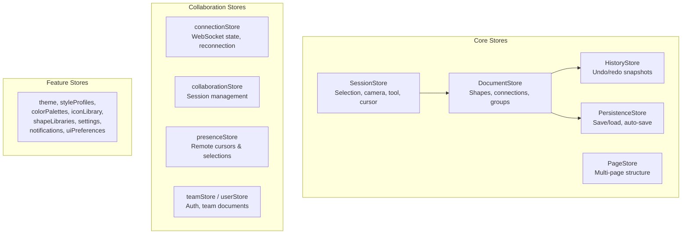

# State Management

Diagrammer uses **Zustand** with **Immer** middleware for state management. Stores are split by responsibility so that changes to ephemeral UI state (cursor position, active tool) don't trigger re-renders on document data, and vice versa.

## Store Architecture



## Core Stores

### DocumentStore

The **single source of truth** for all document content. Holds the shape map, connection data, groups, and the `shapeOrder` array that determines z-ordering.

```typescript
// All mutations go through Immer — never mutate directly
documentStore.updateShape(id, { fill: '#ff0000' });
documentStore.addShapes([newShape]);
documentStore.removeShapes([id1, id2]);
```

::: warning
Never read shape data from anywhere other than DocumentStore. Other stores may hold derived or cached data, but DocumentStore is authoritative.
:::

### SessionStore

Ephemeral UI state that doesn't need to be persisted or synced:

| Field | Purpose |
|-------|---------|
| `selectedShapeIds` | Currently selected shapes |
| `cameraState` | Pan offset and zoom level |
| `activeTool` | Currently active tool name |
| `cursor` | Current cursor style |
| `hoveredShapeId` | Shape under cursor |

### HistoryStore

Implements undo/redo using **complete document snapshots**. Each mutation that should be undoable pushes a snapshot onto the history stack.

```typescript
historyStore.pushSnapshot(documentState);
historyStore.undo(); // Restores previous snapshot
historyStore.redo(); // Re-applies undone snapshot
```

### PageStore

Manages multi-page document structure — page ordering, active page, page metadata. Each page has its own set of shapes in DocumentStore.

### PersistenceStore

Coordinates saving and loading documents:
- **Auto-save** with configurable interval
- **localStorage** for document metadata
- **IndexedDB** (via BlobStorage) for binary content

## Collaboration Stores

These stores manage real-time multi-user state:

| Store | Responsibility |
|-------|----------------|
| `connectionStore` | WebSocket connection lifecycle, auth token, reconnection backoff |
| `collaborationStore` | Active session info, connected users |
| `presenceStore` | Remote cursor positions, remote selections — updated via Yjs awareness |
| `teamStore` | Team membership, document sharing |
| `userStore` | Current user identity, JWT tokens |
| `documentRegistry` | Unified index of local, remote, and cached documents |

## Storage Layer

### BlobStorage

Content-addressed storage using SHA-256 hashing. Stored in IndexedDB.

- **Deduplication** — identical content is stored once regardless of how many shapes reference it
- **Reference counting** — tracks which documents use which blobs
- **Garbage collection** — `BlobGarbageCollector` cleans up orphaned blobs

### TeamDocumentCache

IndexedDB cache for offline access to team documents. Uses LRU eviction when storage limits are approached. `StorageQuotaMonitor` tracks usage proactively.

### TrashStorage

Soft-delete with configurable retention period. Documents go to trash first and can be recovered before permanent deletion.

## Immer Patterns

All state mutations use Immer's produce pattern (via Zustand middleware). This means you write mutations that look like direct mutation but produce immutable updates with structural sharing:

```typescript
// Inside a Zustand store with Immer middleware
updateShape: (id, updates) =>
  set((state) => {
    const shape = state.shapes[id];
    if (shape) {
      Object.assign(shape, updates); // Looks mutable, but Immer makes it immutable
    }
  }),
```

Structural sharing ensures unchanged objects are reused — if you update one shape, all other shapes keep the same object references, so React components subscribed to them don't re-render.
