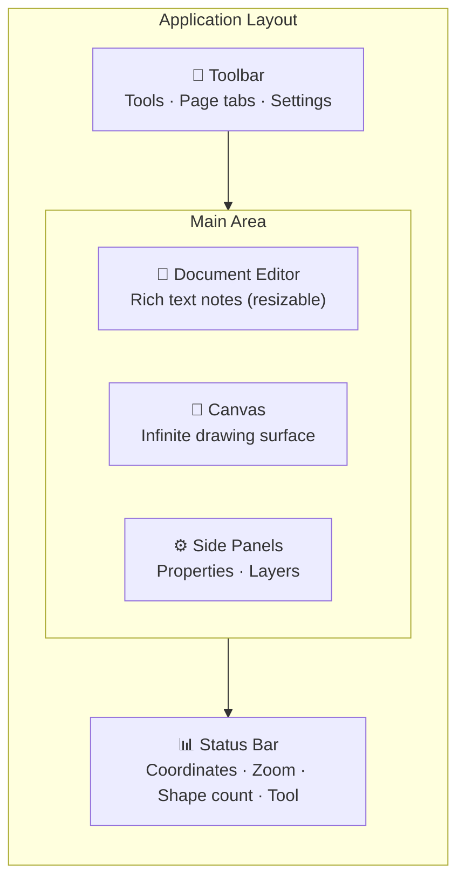

# Interface Tour

Here's a quick overview of everything you see when you open a document in Diagrammer.

## Layout Overview

## The Toolbar

The toolbar runs across the top of the screen. From left to right:

- **Tool buttons** — Select, Rectangle, Ellipse, Line, Connector, Text, Hand, and more
- **File import** — Embed files (PDFs, images, spreadsheets) onto your canvas
- **Page tabs** — Switch between pages in your document, or create new ones
- **Whiteboard** — Open the sticky-note brainstorming overlay (`Ctrl+I`)
- **Settings** — App configuration, document management, collaboration

## The Canvas

The large central area is your infinite drawing surface. This is where your diagram lives.

- **Pan** by middle-clicking and dragging, or by holding Space and dragging
- **Zoom** with the scroll wheel — it zooms toward your cursor
- **Navigate** with WASD keys (like a game) or arrow keys
- The **grid** helps you align shapes — toggle it in Settings

## Document Editor

The left panel is a full rich text editor powered by Tiptap. Use it to write documentation alongside your diagrams.

- Supports headings, lists, tables, images, LaTeX math, and code blocks
- Each page has its own text content
- Toggle it by clicking the **Document** tab

## Property Panel

The right-side panel shows properties for whatever you have selected:

- **Position & size** — X, Y, width, height, rotation
- **Fill & stroke** — Colors, opacity, border style
- **Text** — Font, size, alignment, color
- **Shape-specific settings** — Corner radius, arrow styles, connector routing, etc.

When nothing is selected, the panel is empty.

## Layer Panel

Also on the right side (toggle between Property and Layer panels):

- Shows all shapes in your document in stacking order
- **Drag** shapes to reorder them (front to back)
- **Click** a shape name to select it on the canvas
- Groups show as expandable trees

## Status Bar

The bottom bar shows you:

- **Mouse coordinates** in world space
- **Zoom level** (click to reset)
- **Shape count** for the current page
- **Active tool** name
- **Connection status** when collaborating (🟢 Connected, 🟡 Reconnecting, 🔴 Offline)

## Keyboard Quick Reference

These are the shortcuts you'll use most often:

| Action | Key |
|--------|-----|
| Select tool | `V` |
| Rectangle | `R` |
| Ellipse | `O` |
| Connector | `C` |
| Text | `T` |
| Hand (pan) | `H` |
| Undo / Redo | `Ctrl+Z` / `Ctrl+Shift+Z` |
| Command Palette | `Ctrl+K` |

See the full list in [Keyboard Shortcuts](/guide/keyboard-shortcuts).

## Next Steps

Now that you know the layout, explore the features:

- **[Canvas & Navigation](/guide/canvas-navigation)** — Pan, zoom, WASD, minimap, grid, and snapping
- **[Drawing Tools](/guide/drawing-tools)** — All the tools and shape manipulation
- **[Shape Libraries](/guide/shape-libraries)** — Flowchart, UML, ERD, cloud icons, and custom libraries
