# Quick Start

This guide walks you through creating your first diagram with Diagrammer.

## Creating a New Document

1. **Launch Diagrammer**

   Open the application. You'll see the Document Browser with your recent documents.

2. **Create a new document**

   Click the **+ New Document** button or press `Ctrl+N` (`Cmd+N` on Mac).

3. **Name your document**

   Enter a name for your diagram and click **Create**.

## The Interface

Once your document opens, you'll see:

```mermaid
flowchart TB
    subgraph layout["Application Layout"]
        direction TB
        toolbar["🔧 Toolbar<br/>Tools, page tabs, settings"]
        subgraph middle["Main Area"]
            direction LR
            editor["📝 Document Editor<br/>Rich text notes"]
            canvas["🎨 Canvas<br/>Infinite drawing surface"]
            panels["⚙️ Panels<br/>Properties & Layers"]
        end
        status["📊 Status Bar<br/>Coordinates, zoom, shape count"]
    end
    toolbar --> middle --> status
```

- **Toolbar**: Select tools, switch pages, access settings
- **Canvas**: Your infinite drawing surface
- **Property Panel**: Edit selected shape properties
- **Layer Panel**: Manage shape ordering and visibility
- **Document Editor**: Add rich text notes alongside your diagram

## Adding Shapes

1. **Select a shape tool**

   Click on **Rectangle** in the toolbar (or press `R`).

2. **Draw the shape**

   Click and drag on the canvas to create a rectangle.

3. **Add more shapes**

   Try adding an **Ellipse** (`E`) and a **Text** box (`T`).

## Connecting Shapes

1. **Select the Connector tool**

   Press `C` or click the connector icon in the toolbar.

2. **Connect two shapes**

   Click on the first shape's connection point (small circles that appear on hover), then click on the second shape's connection point.

3. **The connector auto-routes**

   Connectors automatically find the best path between shapes and update when you move shapes.

## Basic Operations

### Selection
- **Click** a shape to select it
- **Shift+Click** to add to selection
- **Drag** on empty canvas to marquee select
- Press `A` to select all shapes

### Moving & Resizing
- **Drag** selected shapes to move them
- **Drag handles** to resize
- Hold **Shift** while dragging to constrain proportions

### Editing
- **Double-click** a shape to edit its text
- Use the **Property Panel** to change colors, borders, fonts
- Press `Delete` to remove selected shapes

### Navigation
- **Scroll wheel** to zoom in/out
- **Middle-click drag** or **Space+drag** to pan
- Press `0` to reset zoom to 100%
- Press `1` to fit all shapes in view

## Saving Your Work

Diagrammer auto-saves your work, but you can also:

- Press `Ctrl+S` to save immediately
- Use **File → Export** to export as PNG, SVG, or JSON
- Click the document name to rename

## Keyboard Shortcuts

Here are the essential shortcuts to memorize:

| Action | Shortcut |
|--------|----------|
| Select tool | `V` |
| Rectangle | `R` |
| Ellipse | `E` |
| Line | `L` |
| Connector | `C` |
| Text | `T` |
| Undo | `Ctrl+Z` |
| Redo | `Ctrl+Shift+Z` |
| Delete | `Delete` |
| Select all | `Ctrl+A` |
| Copy | `Ctrl+C` |
| Paste | `Ctrl+V` |

See the full list in [Keyboard Shortcuts](/reference/keyboard-shortcuts).

## Next Steps

Now that you've created your first diagram, explore:

- [Canvas & Tools](./canvas-tools) - Deep dive into all tools
- [Shape Libraries](./shape-libraries) - Use flowchart, UML, and ERD shapes
- [Collaboration](./collaboration) - Work with your team in real-time
