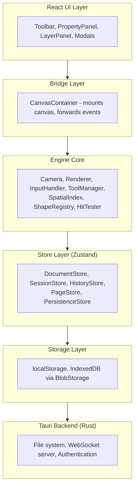

This page provides a bird's-eye view of Diagrammer's architecture. For detailed coverage of specific systems, see the linked pages.

## Technology Stack

| Layer | Technology |
|-------|------------|
| Runtime | Bun (package manager, JS runtime) |
| Desktop | Tauri v2 (Rust backend) |
| Language | TypeScript (strict), Rust |
| UI Framework | React 18+ |
| Canvas | Canvas 2D API (pure, no libraries) |
| State | Zustand + Immer |
| Collaboration | Yjs CRDTs over WebSocket |
| Rich Text | Tiptap (ProseMirror) |
| Spatial Index | RBush (R-tree) |
| Build | Vite (frontend), Cargo (Rust) |

## Architecture Layers

### React UI Layer

React handles only the UI chrome (toolbar, panels, modals). It does **not** render the canvas. Key components: `App.tsx`, `Toolbar.tsx`, `PropertyPanel.tsx`, `LayerPanel.tsx`, `CanvasContainer.tsx` (the bridge to the engine).

### Engine Core

Pure TypeScript classes handling canvas rendering and interaction — no React dependency. Camera, Renderer, InputHandler, ToolManager, SpatialIndex, HitTester, and ShapeRegistry. See [Core Systems](../developer/core-systems/) for details.

### Store Layer

Zustand stores with Immer for immutable updates, split by responsibility:

| Store | Responsibility |
|-------|----------------|
| DocumentStore | Shape data, connections, groups — single source of truth |
| SessionStore | Selection, camera, active tool — ephemeral UI state |
| HistoryStore | Undo/redo snapshots |
| PageStore | Multi-page structure |
| PersistenceStore | Save/load, auto-save |

See [State Management](../developer/state-management/) for the full breakdown including collaboration and feature stores.

### Storage Layer

Hybrid storage — **localStorage** for document metadata and preferences, **IndexedDB** for binary blobs via `BlobStorage.ts` (content-addressed with SHA-256 hashing, deduplication, and garbage collection).

### Tauri Backend

The Rust backend (`src-tauri/`) provides native file system access, a WebSocket server for collaboration, and JWT authentication. See [Collaboration Protocol](../developer/collaboration-protocol/) for the wire protocol details.

## Key Design Decisions

### Shapes Are Data

Shapes are plain JSON-serializable objects with no methods. All behavior (rendering, hit testing, bounds calculation) is implemented via the **ShapeRegistry** pattern — handler functions registered per shape type.

### Canvas Is Not React

React never touches the canvas. The render loop is a `requestAnimationFrame` cycle in the Engine core. This avoids React reconciliation overhead and enables 60fps with 10,000+ shapes.

### Coordinate Transforms Are Centralized

The Camera class owns all coordinate math. Tools, hit testing, and rendering all go through Camera methods — no manual pan/zoom application anywhere.

### Offline First

The app works fully offline. Collaboration features (Protected Local mode) use WebSocket + Yjs CRDTs with an offline queue that persists pending operations to IndexedDB and replays them on reconnection.

## Extension Points

| Extension | Mechanism |
|-----------|-----------|
| Custom shapes | Register handlers with `ShapeRegistry` |
| Custom panels | Use `PanelExtensions.ts` registry |
| Export formats | Add exporters to `exportUtils.ts` |
| Shape libraries | Create collections under `/src/shapes/library/` |

## Next Steps

- [Core Systems](../developer/core-systems/) — coordinate pipeline, rendering, shape registry, tools
- [State Management](../developer/state-management/) — Zustand store architecture
- [Collaboration Protocol](../developer/collaboration-protocol/) — WebSocket protocol, CRDT sync, offline support
- [Project Setup](../developer/project-setup/) — development environment and commands
- [Contributing](../developer/contributing/) — code style, testing, and PR guidelines
