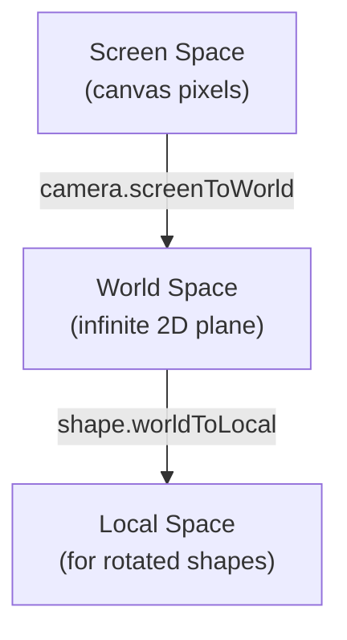

import { Aside } from '@astrojs/starlight/components';

This page covers the core runtime systems that power Diagrammer's canvas — the coordinate pipeline, rendering engine, shape registry, and tool state machines.

## Coordinate System

Every point on screen goes through a well-defined transform pipeline. The **Camera** class owns all coordinate math.



- **Screen Space** — raw canvas pixels, origin at top-left.
- **World Space** — the infinite 2D plane users navigate. Pan and zoom transform between screen and world.
- **Local Space** — shape-relative coordinates, used for rotated or grouped shapes.

<Aside type="caution">
  Never manually apply pan/zoom transforms. Always use `camera.screenToWorld()` and `camera.worldToScreen()`. All tools receive both `screenPoint` and `worldPoint` in every event.
</Aside>

### Camera

The Camera class (`/src/engine/Camera.ts`) holds the current viewport state (pan offset + zoom level) and provides:

| Method | Purpose |
|--------|---------|
| `screenToWorld(point)` | Convert screen pixel to world coordinate |
| `worldToScreen(point)` | Convert world coordinate to screen pixel |
| `applyTransform(ctx)` | Set the canvas context transform for rendering |
| `getViewportBounds()` | Get the visible world-space rectangle |

## Rendering Engine

Canvas rendering is entirely separate from React. React handles toolbar, panels, and modals. The canvas is managed by the **Engine** core.

### Render Loop

A single `requestAnimationFrame` loop with a dirty flag avoids unnecessary redraws:

```typescript
function render() {
  if (dirty) {
    ctx.clearRect(0, 0, width, height);
    ctx.save();
    camera.applyTransform(ctx);
    drawGrid(ctx, camera);
    for (const shape of visibleShapes) {
      ShapeRegistry.render(shape.type, ctx, shape, camera);
    }
    ctx.restore();
    // Overlays (selection handles, guides) in screen space
    activeTool.renderOverlay(ctx, toolCtx);
    dirty = false;
  }
  requestAnimationFrame(render);
}
```

### Viewport Culling

Only shapes intersecting the current viewport are drawn. The spatial index provides O(log n) lookups:

```typescript
const viewportBounds = camera.getViewportBounds();
const visibleShapes = spatialIndex.search(viewportBounds);
```

### Spatial Index

**RBush** (R-tree) powers spatial queries for both rendering and hit testing:

```typescript
// Efficient area queries
const candidates = spatialIndex.search({ minX, minY, maxX, maxY });

// The index is rebuilt when shapes change position or size
spatialIndex.clear();
spatialIndex.load(allShapeBounds);
```

### Hit Testing

The **HitTester** combines spatial index for fast candidate lookup with per-shape precise tests:

1. Query spatial index for shapes overlapping the click point
2. Iterate candidates in reverse z-order (`shapeOrder` array)
3. Call each shape handler's `hitTest()` for pixel-accurate detection
4. Return the topmost hit

## Shape System

Shapes are **plain data objects** — they carry no methods. All behavior lives in the **ShapeRegistry**.

### Shape Data

Every shape extends `BaseShape`:

```typescript
interface BaseShape {
  id: string;
  type: string;
  x: number;
  y: number;
  width: number;
  height: number;
  rotation: number;
  fill: string;
  stroke: string;
  strokeWidth: number;
  opacity: number;
  locked: boolean;
  visible: boolean;
}
```

### ShapeRegistry Pattern

Each shape type registers a handler with five methods:

```typescript
ShapeRegistry.register('rectangle', {
  render(ctx, shape, camera)  { /* draw to canvas */ },
  hitTest(shape, point)       { /* true if point inside */ },
  getBounds(shape)            { /* return bounding Box */ },
  getHandles(shape)           { /* resize/rotation handles */ },
  create(props)               { /* factory with defaults */ },
});
```

This pattern means:
- Adding a new shape type is a single file with a `register()` call
- Shape data is serializable (JSON) — no class instances
- Handlers are pure functions — easy to test

### Shape Libraries

Libraries are collections of registered shape types grouped by domain:

| Library | Shapes |
|---------|--------|
| **Basic** | Rectangle, Ellipse, Line, Text, Connector, Group |
| **Flowchart** | Process, Decision, Terminator, Data, Document, Predefined Process, and more |
| **UML** | Class, Interface, Actor, Use Case, Note, State, etc. |
| **ERD** | Entity, Relationship, Attribute |

Custom libraries can be created, exported, and shared via IndexedDB storage.

### Shape Metadata

`/src/shapes/ShapeMetadata.ts` provides declarative property definitions for each shape type. The **PropertyPanel** uses this metadata to dynamically render controls — no per-shape UI code needed.

## Tool Architecture

Tools are **state machines** that respond to normalized input events. One tool is active at a time, managed by **ToolManager**.

### Tool Interface

```typescript
interface Tool {
  name: string;
  onPointerDown(event: NormalizedPointerEvent, ctx: ToolContext): void;
  onPointerMove(event: NormalizedPointerEvent, ctx: ToolContext): void;
  onPointerUp(event: NormalizedPointerEvent, ctx: ToolContext): void;
  onKeyDown(event: KeyboardEvent, ctx: ToolContext): void;
  renderOverlay(ctx: CanvasRenderingContext2D, toolCtx: ToolContext): void;
}
```

### ToolContext

Every tool callback receives a `ToolContext` providing:

| Property | Purpose |
|----------|---------|
| `camera` | Coordinate transforms |
| `documentStore` | Shape data access and mutations |
| `sessionStore` | Selection, active tool, cursor |
| `hitTester` | Shape detection under cursor |
| `requestRender` | Signal that the canvas needs redrawing |

### Input Handling

The **InputHandler** normalizes mouse, touch, and pen events into a unified `NormalizedPointerEvent` that always carries both `screenPoint` and `worldPoint`. It handles pointer capture on down and release on up, and prevents default on wheel events to avoid browser scrolling.

### Built-in Tools

| Tool | Behavior |
|------|----------|
| **Select** | Click to select, drag to move, handles for resize/rotate, marquee selection |
| **Rectangle / Ellipse** | Click-drag to create, Shift for constrained proportions |
| **Line** | Click start and end points |
| **Connector** | Click source → target shapes, auto-routing |
| **Text** | Click to place, enter edit mode |
| **Hand (Pan)** | Drag to pan the canvas |
