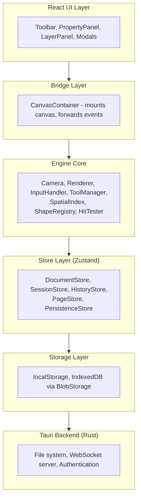
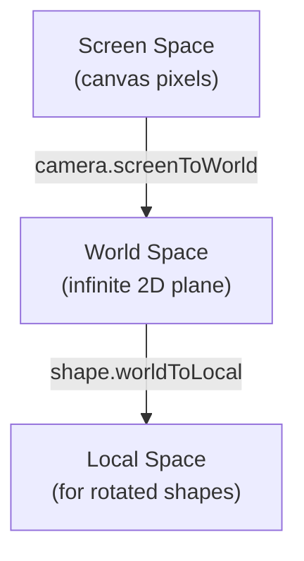

import { Aside } from '@astrojs/starlight/components';

This document describes Diagrammer's technical architecture for developers who want to understand, extend, or contribute to the project.

## Technology Stack

| Layer | Technology |
|-------|------------|
| Runtime | Bun (package manager, JS runtime) |
| Desktop | Tauri v2 (Rust backend) |
| Language | TypeScript (strict), Rust |
| UI Framework | React 18+ |
| Canvas | Canvas 2D API (pure, no libraries) |
| State | Zustand + Immer |
| Collaboration | Yjs CRDTs over WebSocket |
| Rich Text | Tiptap (ProseMirror) |
| Spatial Index | RBush (R-tree) |
| Build | Vite (frontend), Cargo (Rust) |

## Architecture Layers



### React UI Layer

React handles only the UI chrome (toolbar, panels, modals). It does NOT render the canvas.

Key components:
- `App.tsx` - Root component with layout
- `Toolbar.tsx` - Tool selection, page tabs
- `PropertyPanel.tsx` - Shape property editing
- `LayerPanel.tsx` - Shape hierarchy management
- `CanvasContainer.tsx` - Bridge to canvas engine

### Engine Core

Pure TypeScript classes handling canvas rendering and interaction. No React dependency.

- **Camera** - Coordinate transforms, pan/zoom
- **Renderer** - Canvas 2D drawing, viewport culling
- **InputHandler** - Normalizes mouse/touch/pen events
- **ToolManager** - Tool state machines
- **SpatialIndex** - R-tree for fast spatial queries
- **HitTester** - Point-in-shape detection
- **ShapeRegistry** - Shape type handlers

### Store Layer

Zustand stores with Immer for immutable updates:

| Store | Responsibility |
|-------|----------------|
| DocumentStore | Shape data, connections, groups |
| SessionStore | Selection, camera, active tool |
| HistoryStore | Undo/redo snapshots |
| PageStore | Multi-page structure |
| PersistenceStore | Save/load, auto-save |

### Storage Layer

Hybrid storage approach:
- **localStorage** - Document metadata, preferences
- **IndexedDB** - Binary blobs (images, large data)

`BlobStorage.ts` provides content-addressed storage with SHA-256 hashing, deduplication, and garbage collection.

## Coordinate System

All coordinate transforms flow through the Camera class:



<Aside type="caution">
  Never manually apply pan/zoom transforms. Always use Camera methods.
</Aside>

## Shape System

Shapes are **plain data objects**. Behavior is implemented via the **ShapeRegistry pattern**.

### Shape Data

```typescript
interface BaseShape {
  id: string;
  type: string;
  x: number;
  y: number;
  width: number;
  height: number;
  rotation: number;
  fill: string;
  stroke: string;
  strokeWidth: number;
  // ... more properties
}
```

### Shape Handlers

Each shape type registers handlers:

```typescript
ShapeRegistry.register('rectangle', {
  render: (ctx, shape, camera) => { ... },
  hitTest: (shape, point) => { ... },
  getBounds: (shape) => { ... },
  getHandles: (shape) => { ... },
  create: (props) => { ... }
});
```

### Shape Libraries

- **Basic**: Rectangle, Ellipse, Line, Text, Connector, Group
- **Flowchart**: Process, Decision, Terminator, etc.
- **UML**: Class, Interface, Actor, Use Case, etc.
- **ERD**: Entity, Relationship, Attribute

## Tool Architecture

Tools are state machines responding to normalized input events:

```typescript
interface Tool {
  name: string;
  onPointerDown(event: NormalizedPointerEvent, ctx: ToolContext): void;
  onPointerMove(event: NormalizedPointerEvent, ctx: ToolContext): void;
  onPointerUp(event: NormalizedPointerEvent, ctx: ToolContext): void;
  onKeyDown(event: KeyboardEvent, ctx: ToolContext): void;
  renderOverlay(ctx: CanvasRenderingContext2D, toolCtx: ToolContext): void;
}
```

The `ToolContext` provides:
- Camera for coordinate transforms
- Stores for state access
- HitTester for shape detection
- requestRender callback

## Collaboration Architecture

Real-time collaboration uses **Protected Local mode**:

1. One user hosts (Tauri WebSocket server)
2. Others connect via `UnifiedSyncProvider`
3. Changes sync via Yjs CRDTs

### Protocol

The TypeScript protocol (`/src/collaboration/protocol.ts`) must stay in sync with Rust (`src-tauri/src/server/protocol.rs`).

Message types:
- `SYNC (0)` - Yjs sync messages
- `AWARENESS (1)` - Cursor/selection presence
- `AUTH (2)` - Authentication
- `DOC_LIST/GET/SAVE/DELETE (3-6)` - CRUD operations
- `DOC_EVENT (7)` - Document events
- `JOIN_DOC (10)` - Join session
- `AUTH_LOGIN (11)` - Login request

### Offline Support

- **OfflineQueue** - Queues operations when disconnected
- **SyncStateManager** - Coordinates sync state
- **SyncQueueStorage** - IndexedDB persistence

## Performance Strategies

Diagrammer targets **60fps with 10,000+ shapes**.

### Viewport Culling

Only shapes intersecting the viewport are rendered:

```typescript
const visibleShapes = spatialIndex.search(viewportBounds);
for (const shape of visibleShapes) {
  renderer.drawShape(shape);
}
```

### Spatial Indexing

RBush R-tree enables O(log n) spatial queries:

```typescript
// Fast query for shapes in an area
const shapes = spatialIndex.search({
  minX, minY, maxX, maxY
});
```

### Efficient State Updates

Immer provides structural sharing - unchanged objects are reused:

```typescript
// Only creates new objects for changed shapes
documentStore.updateShape(id, { fill: 'red' });
```

### Render Loop

Single requestAnimationFrame loop with dirty flag:

```typescript
function render() {
  if (dirty) {
    ctx.clearRect(0, 0, width, height);
    ctx.save();
    camera.applyTransform(ctx);
    // Draw shapes...
    ctx.restore();
    dirty = false;
  }
  requestAnimationFrame(render);
}
```

## Testing

Tests use Vitest with jsdom environment. Test files live alongside source:

| Module | Description |
|--------|-------------|
| `/src/math/` | Vec2, Mat3, Box, geometry |
| `/src/engine/` | Camera, InputHandler, Renderer |
| `/src/store/` | All Zustand stores |
| `/src/shapes/` | Shape handlers, utilities |
| `/src/collaboration/` | Protocol, sync providers |

Run tests:
```bash
bun run test        # Watch mode
bun run test --run  # Single run
```

## Extension Points

### Custom Shapes

Register new shape types with ShapeRegistry.

### Panel Extensions

Use `PanelExtensions.ts` to add custom panels.

### Export Formats

Add exporters to `exportUtils.ts`.

## Code Guidelines

1. **No `any` types** - Use `unknown` with type guards
2. **Immutable updates** - All mutations through Immer
3. **Pure functions** - Shape handlers should be pure
4. **Small files** - One responsibility per file
5. **Test the math** - Geometry functions require tests
